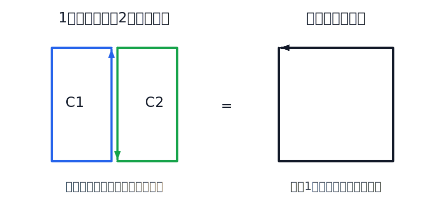
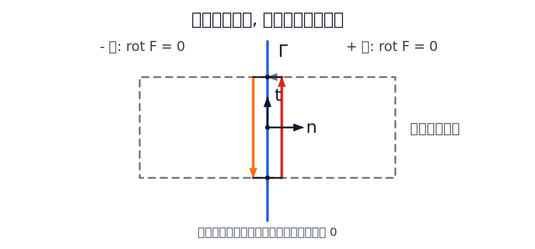

この資料では, 第8週演習問題のうち, 不連続な力場が保存力かどうかを判定する部分を補足する. 特に, 「閉曲線を貼り合わせる」という線積分の基本操作と, それを使って不連続線の寄与だけを取り出す考え方を説明する.

## 前半: 閉曲線を貼り合わせる

線積分でまず重要なのは, 経路の向きを反転すると符号が反転することである. 経路 $\gamma$ の向きを逆にした経路を $-\gamma$ と書くと,

$$
\int_{-\gamma}\mathbf{F}\cdot d\mathbf{r}
=
-\int_{\gamma}\mathbf{F}\cdot d\mathbf{r}
$$

である.

この性質から, 2 つの閉曲線が一部の経路を逆向きに共有しているとき, 共有部分の線積分は打ち消し合う.

::: {.content-visible when-format="html"}
{width=90%}
:::

::: {.content-visible when-format="pdf"}
{width=90%}
:::

図の左側の 2 つの閉曲線を $C_1$, $C_2$ とする. $C_1$ は共有経路 $\gamma$ を上向きに通り, $C_2$ は同じ共有経路を下向きに通るとする. つまり $C_2$ では共有部分が $-\gamma$ として現れる.

このとき,

$$
\begin{aligned}
\oint_{C_1}\mathbf{F}\cdot d\mathbf{r}
+
\oint_{C_2}\mathbf{F}\cdot d\mathbf{r}
&=
\int_{\text{外側1}}\mathbf{F}\cdot d\mathbf{r}
+
\int_{\gamma}\mathbf{F}\cdot d\mathbf{r}
+
\int_{\text{外側2}}\mathbf{F}\cdot d\mathbf{r}
+
\int_{-\gamma}\mathbf{F}\cdot d\mathbf{r}\\
&=
\int_{\text{外側1}}\mathbf{F}\cdot d\mathbf{r}
+
\int_{\text{外側2}}\mathbf{F}\cdot d\mathbf{r}.
\end{aligned}
$$

したがって, 2 つの閉曲線の線積分の和は, 共有部分を消して 1 つに融合した閉曲線 $C_1\# C_2$ の線積分に等しい:

$$
\oint_{C_1}\mathbf{F}\cdot d\mathbf{r}
+
\oint_{C_2}\mathbf{F}\cdot d\mathbf{r}
=
\oint_{C_1\# C_2}\mathbf{F}\cdot d\mathbf{r}.
$$

これは図形的には単純だが, 不連続な力場を扱うときの基本操作である. 小さい閉曲線を足したり引いたりしても, 共有部分の寄与は逆向きに現れて消える.

## 回転が 0 の領域では経路を変形できる

力場がなめらかな領域 $D$ で

$$
\nabla\times\mathbf{F}
=
\frac{\partial F_y}{\partial x}
-
\frac{\partial F_x}{\partial y}
=0
$$

を満たすとする. このとき, $D$ の中の閉曲線 $C=\partial S$ について, Green の定理より

$$
\oint_C \mathbf{F}\cdot d\mathbf{r}
=
\iint_S
\left(
\frac{\partial F_y}{\partial x}
-
\frac{\partial F_x}{\partial y}
\right)
dx\,dy
=0
$$

である.

したがって, 同じ領域 $D$ の中で経路を少し変形しても, 線積分は変わらない. なぜなら, 変形前の経路と変形後の経路をつなぐと細長い閉曲線ができ, その閉曲線の線積分が 0 だからである.

この議論では, 経路の間に不連続線が入ってはいけない. 回転が 0 と言えるのは, 力場がなめらかな領域の中だけである.

## 後半: 不連続線に張り付いた経路に変形する

次に, なめらかな曲線 $\Gamma$ を境に, 力場が両側で別々に定義されている場合を考える. $\Gamma$ の片側を $+$ 側, もう片側を $-$ 側と書き, 両側の力場を $\mathbf{F}_+$, $\mathbf{F}_-$ とする.

ここで仮定するのは, 両側の領域ではそれぞれ

$$
\nabla\times\mathbf{F}_+=0,\qquad
\nabla\times\mathbf{F}_-=0
$$

である, ということである. ただし, $\Gamma$ 上では力場が不連続でもよい.

任意の閉曲線 $C$ が $\Gamma$ を横切るとする. $+$ 側にある部分は $+$ 側の中で変形でき, $-$ 側にある部分は $-$ 側の中で変形できる. そのため, $C$ の線積分を調べるには, $\Gamma$ のすぐ両側に張り付いた細い経路だけを残せばよい.

::: {.content-visible when-format="html"}
{width=90%}
:::

::: {.content-visible when-format="pdf"}
{width=90%}
:::

図のように, $\Gamma$ の一部を向きつきの曲線 $\gamma$ として取り出す. $\gamma$ の単位接ベクトルを $\mathbf{t}$ とする. 細い経路の幅を 0 に近づけると, $\Gamma$ の両側に平行な部分だけが残る. 不連続線を横切る短い区間は無限小だから, 力場が有限ならその寄与は 0 である.

したがって, 残る寄与は

$$
\int_{\gamma}\mathbf{F}_+\cdot\mathbf{t}\,ds
-
\int_{\gamma}\mathbf{F}_-\cdot\mathbf{t}\,ds
=
\int_{\gamma}
\left(\mathbf{F}_+-\mathbf{F}_-\right)\cdot\mathbf{t}\,ds
$$

である. 向きの取り方によって全体の符号は変わるが, 0 かどうかは変わらない.

任意の閉曲線について線積分が 0 になるためには, 任意の小さな $\gamma$ について上の積分が 0 でなければならない. したがって境界上で

$$
\left(\mathbf{F}_+-\mathbf{F}_-\right)\cdot\mathbf{t}=0
$$

が必要である. 逆に, 両側で回転が 0 であり, さらにこの条件が境界上で成り立つなら, 不連続線に張り付いた経路の寄与も 0 になるので, 任意の閉曲線の線積分は 0 になる.

つまり, 判定条件は

$$
\boxed{\mathbf{F}_+\cdot\mathbf{t}=\mathbf{F}_-\cdot\mathbf{t}}
$$

である. 不連続線をまたいだときに, 力の接線方向成分が跳んでいなければよい.

## 法線ベクトルを使った言い換え

$\Gamma$ の単位法線ベクトルを $\mathbf{n}$ とする. 接線方向成分が等しいという条件は, 差

$$
\Delta\mathbf{F}
=
\mathbf{F}_+-\mathbf{F}_-
$$

が接線方向成分を持たない, という意味である. したがって $\Delta\mathbf{F}$ は法線方向を向く:

$$
\Delta\mathbf{F}\parallel \mathbf{n}.
$$

すなわち, あるスカラー $\lambda$ が存在して

$$
\mathbf{F}_+-\mathbf{F}_-=\lambda\mathbf{n}
$$

と書けることと同値である.

成分で書けば, $\mathbf{n}=(n_x,n_y)$ に対して接線ベクトルを $\mathbf{t}=(-n_y,n_x)$ と取れるので,

$$
\left(\mathbf{F}_+-\mathbf{F}_-\right)\cdot\mathbf{t}
=
-n_y(F_{+x}-F_{-x})
+n_x(F_{+y}-F_{-y})
=0
$$

である.

## 位置エネルギーとの関係

両側で

$$
\mathbf{F}_+=-\nabla U_+,\qquad
\mathbf{F}_-=-\nabla U_-
$$

と書けているとする. 境界 $\Gamma$ 上で接線方向に微分すると,

$$
\frac{d}{ds}(U_+-U_-)
=
\nabla(U_+-U_-)\cdot\mathbf{t}
=
-(\mathbf{F}_+-\mathbf{F}_-)\cdot\mathbf{t}.
$$

したがって

$$
(\mathbf{F}_+-\mathbf{F}_-)\cdot\mathbf{t}=0
$$

なら, $U_+-U_-$ は $\Gamma$ 上で一定である. $\Gamma$ が連結なら, 片側の位置エネルギーの定数項を調整して, 境界上で

$$
U_+=U_-
$$

とできる. これが, 区分的に定義された位置エネルギーを 1 つの位置エネルギーとして貼り合わせるための条件である.

## 問題への使い方

不連続な力場を判定するときは, 次の順で見るとよい.

1. 不連続線の両側で $\nabla\times\mathbf{F}=0$ かを調べる.

2. 不連続線上の単位接ベクトル $\mathbf{t}$ を取る.

3. 境界の両側で $\mathbf{F}_+\cdot\mathbf{t}$ と $\mathbf{F}_-\cdot\mathbf{t}$ を比べる.

4. 接線成分が等しければ, 境界に張り付いた経路の寄与は 0 である. 接線成分が異なれば, その境界をまたぐ細い閉曲線を作ることで, 0 でない線積分が得られる.
   不連続線上で力場をどの値に定義するかは本質的ではない. 線積分で効くのは, 両側から近づいたときの接線方向成分の差である.
