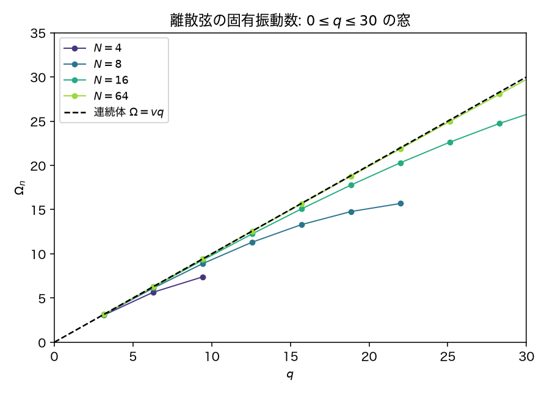

このページには, 第9週の講義内容に対応する演習問題をまとめる. 今週は, 安定点まわりの 2 次近似, 連成振動, 減衰・強制振動, 連続極限と波動方程式を扱う.

::: {.content-visible when-format="html"}
同じ内容の [PDF](pdf/week9-exercises.pdf) もある.
:::

## 問題1 {.unnumbered}

2 次元平面内で, 質量 $m$ の質点が位置エネルギー

$$
U(x,y)=\frac{k}{2}(x^2+y^2)+\kappa xy
$$

のもとで運動している. ただし $k>0$ とし, $|\kappa|<k$ とする.

1. 力 $\mathbf{F}=-\nabla U$ を求め, 抵抗力も外力もない場合の運動方程式を $x,y$ 成分で書け. この方程式が一般には $x$ 方向と $y$ 方向に分離していないことを確認せよ.

2. $U$ の 2 次形式を表す行列 $K$ を求めよ. さらに, 直交行列

$$
P=\frac{1}{\sqrt{2}}
\begin{pmatrix}
1&1\\
1&-1
\end{pmatrix}
$$

   を用いて $P^T K P$ を計算し, $K$ を対角化せよ. また, 条件 $|\kappa|<k$ が安定性とどう関係するか説明せよ.

3. 2. の対角化に対応する新しい座標を

$$
\begin{pmatrix}
q_+\\
q_-
\end{pmatrix}
=
P^T
\begin{pmatrix}
x\\
y
\end{pmatrix}
$$

   で定義する. $q_+,q_-$ を $x,y$ で書き下せ. そのうえで, $U$ を $q_+,q_-$ で表し, 抵抗力も外力もない場合の運動方程式を $q_+,q_-$ について書け. さらに, 2 つの固有角振動数 $\omega_+,\omega_-$ を求めよ.

4. 速度に比例する抵抗力と, $x$ 方向の周期外力

$$
\mathbf{F}_{\mathrm{res}}=-m\gamma \dot{\mathbf{r}},
\qquad
\mathbf{F}_{\mathrm{ext}}(t)=F_0\cos\omega t\,\mathbf{e}_x
$$

がはたらくとする. ここで $\mathbf{r}=(x,y)$, $\gamma>0$, $F_0>0$ とする. この書き方では $\gamma$ は単位質量あたりの減衰率を表す. 運動方程式を $x,y$ 成分で書き, さらに $q_+,q_-$ についての方程式に書き直せ.

5. 複素表示を用い, 外力を $F_0 e^{i\omega t}\mathbf{e}_x$ として定常解を求める. $q_\pm(t)=\operatorname{Re}(\tilde q_\pm e^{i\omega t})$ とおき, 複素振幅 $\tilde q_+,\tilde q_-$ を求めよ.

6. 5. の定常解を $x(t),y(t)$ に戻せ. 複素振幅 $\tilde x,\tilde y$ を用いて

$$
x(t)=\operatorname{Re}(\tilde x e^{i\omega t}),\qquad
y(t)=\operatorname{Re}(\tilde y e^{i\omega t})
$$

の形で表せ. また, $x$ 方向に外力を加えているにもかかわらず, 一般に $y(t)$ も 0 でない理由を説明せよ.

7. （発展問題）例えば

$$
m=1,\qquad k=4,\qquad \kappa=1,\qquad \gamma=0.2,\qquad F_0=1
$$

として, $|\tilde x(\omega)|$ と $|\tilde y(\omega)|$ を $\omega$ の関数として描け. 2 つのピークがどの固有振動に対応するか説明せよ. 余裕があれば, いくつかの $\omega$ について定常状態の軌跡 $(x(t),y(t))$ も描け.

## 問題2 {.unnumbered}

長さ $L$ の 1 次元弾性体を, 間隔

$$
a=\frac{L}{N}
$$

で離散化する. 点 $x_i=ia$ における横変位を $u_i(t)$ とする. 両端は固定されており,

$$
u_0(t)=u_N(t)=0
$$

とする. 線密度を $\mu$, 張力を $T$ とする.

小問1〜4 は教科書 5.4.1 項（波動方程式の導出）の復習である. 結果を手早く確認し, 教科書では扱わない小問5・6（離散系の固有振動数と分散関係）に重点を置く.

1. 内部の各質点の質量 $m_N$ を, $\mu$ と $a$ を用いて表せ.

2. 連続体の弾性エネルギー

$$
U=\frac{T}{2}\int_0^L
\left(\frac{\partial u}{\partial x}\right)^2 dx
$$

   を差分で近似して

$$
U_N=\sum_{i=0}^{N-1}\frac{k_N}{2}(u_{i+1}-u_i)^2
$$

   の形に書き, 有効なばね定数 $k_N$ を $T$ と $a$ で表せ. また, $N$ を大きくすると $k_N$ がどうスケールするか述べよ.（ヒント: ばね定数は長さに反比例し, 弾性体を半分の長さに切ると $2$ 倍になる.）

3. 内部点 $i=1,\dots,N-1$ について, 運動方程式

$$
m_N\ddot u_i=k_N(u_{i+1}-2u_i+u_{i-1})
$$

を導け.

4. $u_i(t)=u(t,x_i)$ とみなし, $a\to0$ の極限を考える. 3. の式から波動方程式

$$
\frac{\partial^2 u}{\partial t^2}
=
v^2\frac{\partial^2 u}{\partial x^2}
$$

を導き, 波の速さ $v$ を $T$ と $\mu$ を用いて表せ.

5. **（ここからが本問の中心である.）** 離散系の固有振動を

$$
u_i(t)=A\sin\frac{n\pi i}{N}\cos\Omega_n t
$$

の形で考える. ただし $n=1,2,\dots,N-1$ とする. 小問3の運動方程式に代入し, 和積公式を用いて固有角振動数

$$
\Omega_n=2\sqrt{\frac{k_N}{m_N}}\left|\sin\frac{n\pi}{2N}\right|
$$

を導け. また, $N$ が大きく $n$ が固定されているとき, $\Omega_n$ が連続体の固有角振動数

$$
\Omega_n\simeq \frac{n\pi}{L}\sqrt{\frac{T}{\mu}}
$$

に近づくことを示せ.

6. （発展問題）$L=1$, $\mu=1$, $T=1$ とする. 許される波数を

$$
q_n=\frac{n\pi}{L}\qquad (n=1,2,\dots,N-1)
$$

   とおくと, 固有角振動数は

$$
\Omega_n
=
\frac{2v}{a}\left|\sin\frac{q_n a}{2}\right|,
\qquad
v=\sqrt{\frac{T}{\mu}}
$$

   と書ける. 下の図は, いくつかの $N$（$N=4,8,16,64$）について, 横軸を $q$ として $(q_n,\Omega_n)$ を描いたものである. 各 $N$ について $n=1,\dots,N-1$ の全モードを計算しているが, 図では固定した $q$ の窓として $0\le q\le30$ の範囲だけを表示している. この図を再現し, 次の点を考察せよ.

::: {.content-visible when-format="html"}
{width=90%}
:::

::: {.content-visible when-format="pdf"}
{width=90%}
:::

   - 横軸を $qa$ ではなく $q$ にする理由を説明せよ. ここで $qa$ は格子 $1$ 間隔あたりの位相の進みを表す.
   - $q$ を固定して $N$ を大きくすると $a=L/N$ が小さくなり, $qa\to0$ となる. このとき $\Omega_n\simeq vq_n$ となることを確認せよ.
   - $qa$ が小さくない領域では, 離散性のために $\Omega_n$ が直線 $vq_n$ からずれることを確認せよ.
