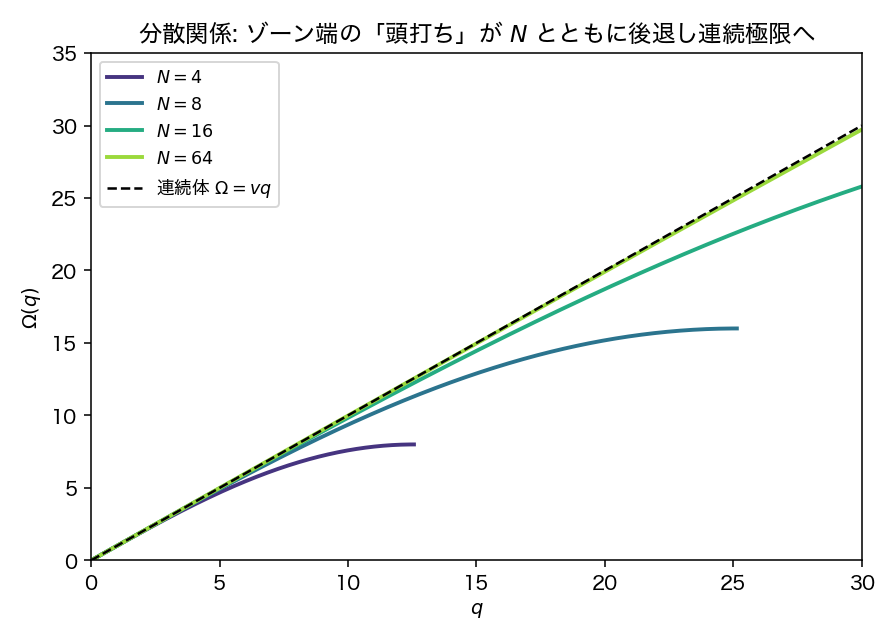
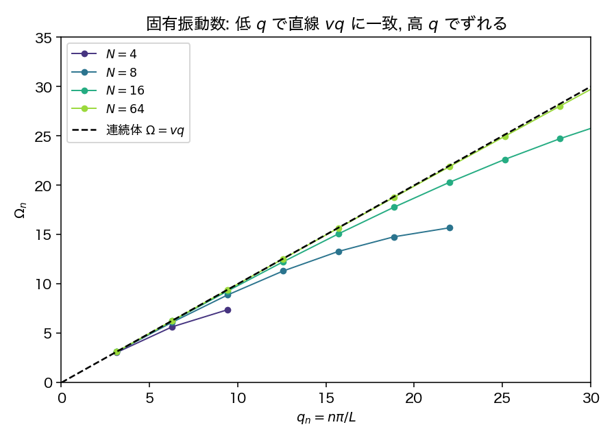

# 第9週 演習 模範解答（教員用・非配布）

教科書（`00main_231212.pdf`）第5章, 講義ノート `book/oscillation-and-wave.qmd` に対応.
記号の対応: 教科書の線密度 $\sigma$ ↔ 本問の $\mu$, 教科書の $\kappa=k\Delta\ell$ ↔ 本問の $T$（$=k_N a$）.

---

## 問題1（2次元の連成振動・強制振動）

**1.** $F_x=-(kx+\kappa y),\ F_y=-(ky+\kappa x)$.
$$
m\ddot x=-(kx+\kappa y),\qquad m\ddot y=-(ky+\kappa x).
$$
$\kappa\neq0$ なら $x,y$ が連成し分離しない.

**2.** $U=\tfrac12(x\,y)A(x\,y)^T$, $A=\begin{pmatrix}k&\kappa\\\kappa&k\end{pmatrix}$.
固有値 $\lambda_\pm=k\pm\kappa$, 固有ベクトル $\mathbf e_\pm=\tfrac1{\sqrt2}(1,\pm1)$.
原点が安定 ⇔ $A$ 正定値 ⇔ 両固有値正 ⇔ $|\kappa|<k$. このとき両モードの実効ばね定数 $k\pm\kappa>0$ で実の振動数をもつ.

**3.** $x=\tfrac{q_++q_-}{\sqrt2},\ y=\tfrac{q_+-q_-}{\sqrt2}$ より
$$
U=\tfrac12[(k+\kappa)q_+^2+(k-\kappa)q_-^2],\qquad
m\ddot q_\pm=-(k\pm\kappa)q_\pm,
$$
$$
\omega_+=\sqrt{\tfrac{k+\kappa}{m}},\qquad \omega_-=\sqrt{\tfrac{k-\kappa}{m}}.
$$

**4.**
$$
m\ddot x=-(kx+\kappa y)-m\gamma\dot x+F_0\cos\omega t,\qquad
m\ddot y=-(ky+\kappa x)-m\gamma\dot y.
$$
$q_\pm$ では（外力は両モードに等分配, 抵抗は $-m\gamma\dot q_\pm$）:
$$
m\ddot q_\pm=-(k\pm\kappa)q_\pm-m\gamma\dot q_\pm+\tfrac{F_0}{\sqrt2}\cos\omega t.
$$
注意: ここでの $\gamma$ は $\mathbf F_{\rm res}=-m\gamma\dot{\mathbf r}$ の定義によるもので, 教科書(5.8) の $2\gamma$ 規約の $\gamma$ の **2倍** に相当する.

**5.** $\omega_\pm^2=\tfrac{k\pm\kappa}{m}$ として
$$
\tilde q_\pm=\frac{F_0/(\sqrt2\,m)}{\omega_\pm^2-\omega^2+i\gamma\omega}.
$$

**6.** $\tilde x=\tfrac{\tilde q_++\tilde q_-}{\sqrt2},\ \tilde y=\tfrac{\tilde q_+-\tilde q_-}{\sqrt2}$:
$$
\tilde x=\frac{F_0}{2m}\Big[\tfrac{1}{\omega_+^2-\omega^2+i\gamma\omega}+\tfrac{1}{\omega_-^2-\omega^2+i\gamma\omega}\Big],\quad
\tilde y=\frac{F_0}{2m}\Big[\tfrac{1}{\omega_+^2-\omega^2+i\gamma\omega}-\tfrac{1}{\omega_-^2-\omega^2+i\gamma\omega}\Big].
$$
$x$ 方向だけ駆動しても基準モード $\mathbf e_\pm$ が $x,y$ 両成分をもつため $y(t)\neq0$. 式の上では $\tilde y\propto\tilde q_+-\tilde q_-$ で, $\kappa\neq0$（$\omega_+\neq\omega_-$）なら $\tilde y\neq0$.

**7.** $m=1,k=4,\kappa=1,\gamma=0.2,F_0=1$ では $\omega_+^2=5,\omega_-^2=3$ なので, ピークは $\omega\simeq\sqrt3\approx1.73$（反対称 $q_-$）と $\omega\simeq\sqrt5\approx2.24$（対称 $q_+$）.

---

## 問題2（離散弦から波動方程式へ）

**1.** $m_N=\mu a=\mu L/N$.

**2.** $\partial_x u\approx(u_{i+1}-u_i)/a$, $\int dx\to\sum a$ より
$$
U\approx\sum_i\frac{T}{2a}(u_{i+1}-u_i)^2\ \Rightarrow\ k_N=\frac{T}{a}=\frac{TN}{L}.
$$
$N$ 大で $k_N\propto N\propto1/a$（教科書の「$\kappa=k\Delta\ell$ は長さ2倍でばね定数半分」に対応）.

**3.** $m_N\ddot u_i=-\partial U_N/\partial u_i=k_N(u_{i+1}-2u_i+u_{i-1})$.

**4.** $m_N=\mu a,\ k_N=T/a$, $u_{i\pm1}-2u_i+u_i\simeq a^2\partial_x^2u$ を代入し
$$
\partial_t^2 u=\frac{T}{\mu}\partial_x^2 u,\qquad v=\sqrt{\frac{T}{\mu}}.
$$

**5.** $u_i=A\sin\frac{n\pi i}{N}\cos\Omega_n t$ を代入し和積公式
$\sin\frac{n\pi(i\pm1)}{N}$ の和 $=2\sin\frac{n\pi i}{N}\cos\frac{n\pi}{N}$ を使うと
$$
-m_N\Omega_n^2=-4k_N\sin^2\frac{n\pi}{2N}
\ \Rightarrow\
\Omega_n=2\sqrt{\frac{k_N}{m_N}}\Big|\sin\frac{n\pi}{2N}\Big|=\frac{2v}{a}\Big|\sin\frac{n\pi}{2N}\Big|.
$$
$N$ 大・$n$ 固定で $\sin\frac{n\pi}{2N}\simeq\frac{n\pi}{2N}$ より
$\Omega_n\simeq\frac{2vN}{L}\cdot\frac{n\pi}{2N}=\frac{n\pi}{L}\sqrt{\frac{T}{\mu}}$.

**6.（発展, 図つき）** $L=\mu=T=1$（$v=1$）. $q_n=n\pi/L$ とすると $q_n a=n\pi/N$ なので
$$
\Omega(q)=\frac{2v}{a}\Big|\sin\frac{qa}{2}\Big|.
$$

図は `make_figures.py` で生成（`python3 make_figures.py`）.

**図1: 分散関係 $\Omega(q)$（ゾーン全体, $N$ を変えて）**

- 小 $q$（$qa\ll1$）では $\sin\frac{qa}{2}\simeq\frac{qa}{2}$ で $\Omega(q)\simeq vq$. どの $N$ でも連続体の線形分散に一致.
- 大 $q$ では直線 $vq$ から下にずれ, ブリルアンゾーン端 $q=\pi/a$ で $d\Omega/dq=0$ の「頭打ち」（離散格子に特有）. 端での値は $\Omega_{\max}=2v/a=2vN/L$.
- $N$ を大きくすると $a=L/N$ が小さくなり, ゾーン端 $q=\pi/a=N\pi/L$ が高 $q$ 側へ伸びる. 固定した $q$ の窓で見ると頭打ちが後退し, 曲線が直線 $vq$ に近づく ＝ 連続極限への移行.

**図2: 固有振動数 $\Omega_n$ vs $q_n=n\pi/L$（離散モード）**

- 実際に許されるモードは $n=1,\dots,N-1$ の離散点（最大波数 $q_{N-1}=(N-1)\pi/L<\pi/a$）.
- 低 $q$ の点は直線 $vq$ にのり, 高 $q$ で下へ外れる. $N$ が大きいほど直線にのる範囲が広い.
